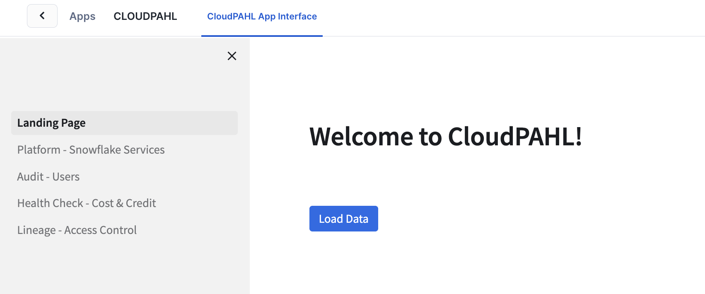
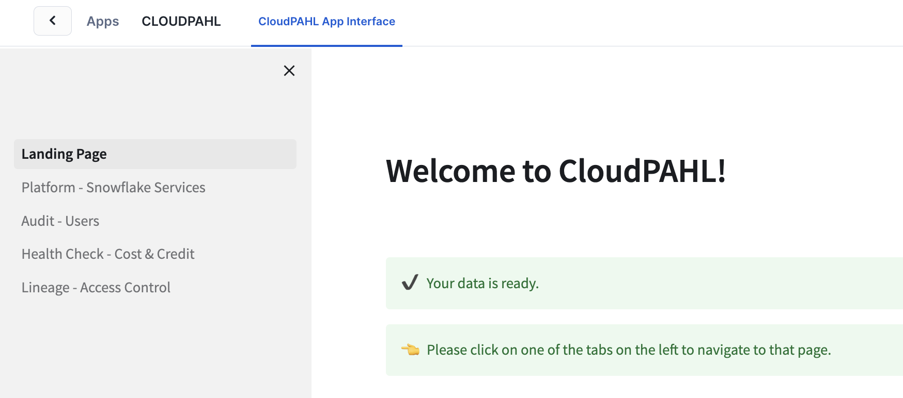
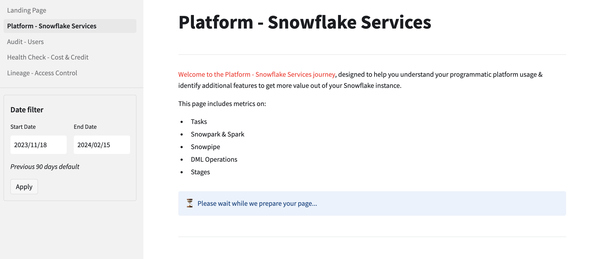
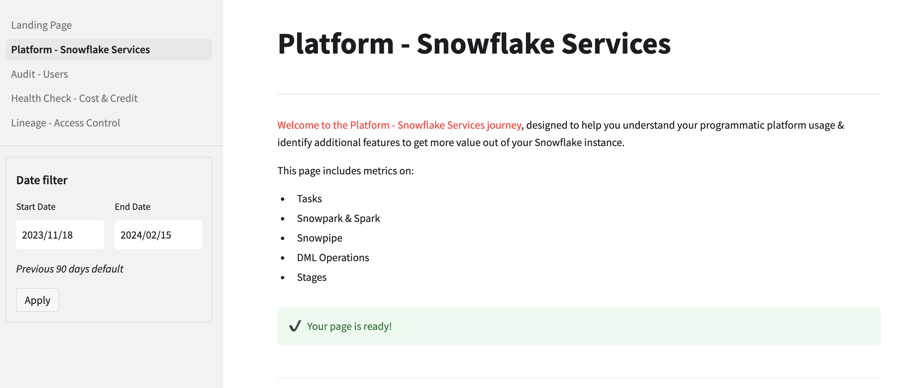
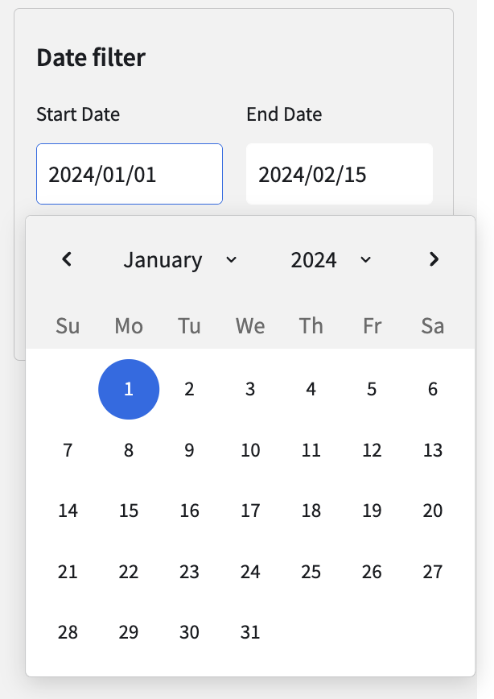
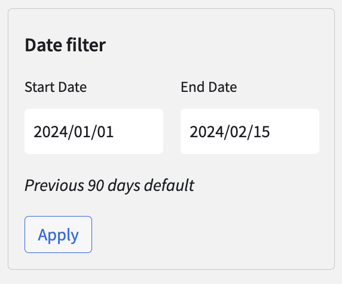

# Welcome to CloudPAHL by Aimpoint Digital! 

## INTRODUCTION
**The purpose of this application is to allow administrators & super users to explore, understand, and optimize their Snowflake account usage.** \
**CloudPAHL** is comprised of four pages: 
1. **Platform Overview:** Summarizes both utilized and underutilized Snowflake Services 
2. **Audit Review:** Examines user behavior, identifies groups in need to additional training, and assesses for necessary action reviews or permission adjustments 
3. **Health Check Analysis:** Assesses cost and credit trends, attributing them to determine if Snowflake is scaling as anticipated or if unexpected costs are emerging and where 
4. **Lineage Visualization:** Displays role and object permissions 

## HOW TO
### 0) Requirements
The application requires access to the **SNOWFLAKE** database. Please use the **ACCOUNTADMIN** role for setup to grant the application access to this database. 
*We recommend running the CloudPAHL app on an XS warehouse, with the ability to auto-scale to 3 clusters maximum.*

### 1) Grant Permissions within CloudPAHL App
1. Please navigate Apps > CloudPAHL > to the **'CloudPAHL App Interface'** tab.
2. Grant application permissions as prompted by app. \
*The warehouse granted here will be utilized only by the task created in step 2 for refreshing app data*

### 2) Run SETUP_CLOUDPAHL() to initialize account usage data for app and set the refresh cadence
1. Navigate to a Snowflake worksheet.
2. ``` CALL CLOUDPAHL.CACHE_TABLES.SETUP_CLOUDPAHL(<refresh-cadence>); ```

\<refresh-cadence\> *OPTIONAL* \
The cadence data is refreshed via task. Accepted values are 'daily', 'weekly', 'monthly', or a custom CRON schedule (with timezone). 
- 'daily' creates task to run daily at 4am UTC
- 'weekly' creates task to run weekly on, every Sunday at 4am UTC
- 'monthly' creates task to run monthly, on the 1st of every month at 4am UTC

*The setup script completion time varies depending on the size of the account and the warehouse running the job. When you see this, or a similar result from `SETUP_CLOUDPAHL()`, you can continue on to the next steps:* \
```Setup complete: Data loaded. Task has been created using a cadence of daily```

### 3) Navigate back to CloudPAHL App and Begin Exploring!



Confirm data has been loaded



Click through the pages in the sidebar. 

You'll see this progress bar as the page loads. 



When the page is fully loaded the status bar will turn green



### (4) Change Date Filters
Choose a new date range. 



Click **'Apply'** to submit selected dates. 



The page will reload with data from selected date range

### Appendix / Example Scripts
```
CALL CLOUDPAHL.TASK_SCHEMA.SETUP_TASK(); 
-- Remove existing task

CALL CLOUDPAHL.TASK_SCHEMA.SETUP_TASK('*/3 * * * * Etc/UTC'); 
-- Update task schedule

CALL CLOUDPAHL.CACHE_TABLES.SETUP_CLOUDPAHL();
-- Loads account usage data once, does not create a recurring task

CALL CLOUDPAHL.CACHE_TABLES.SETUP_CLOUDPAHL('daily', 'compute_wh');
-- Loads account usage data once, creates a tast to update daily

CALL CLOUDPAHL.CACHE_TABLES.SETUP_CLOUDPAHL('0 0,12 * * * Etc/UTC');
-- Loads account usage data, creates task to run twice a day at midnight and noon UTC
```

## ABOUT & HELP
This application was developed by **[Aimpoint Digital](https://aimpointdigital.com/)** - an end-to-end analytics firm that uses data to solve its clients’ most complex use-cases. We offer consulting support across data engineering, data analytics, data science and analytic strategy practices. As an **Elite Snowflake Partner** we can help you with anything from migrations, to native apps to advanced ML in Snowflake.

If you encounter any issues, please do reach out to us directly at **nativeapps@aimpointdigital.com** - be sure to include as many screenshots and detail as possible.
