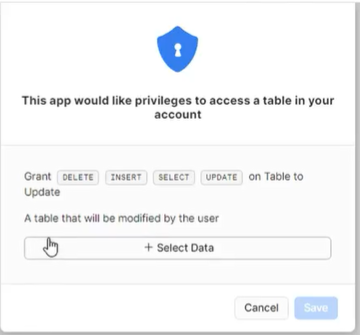
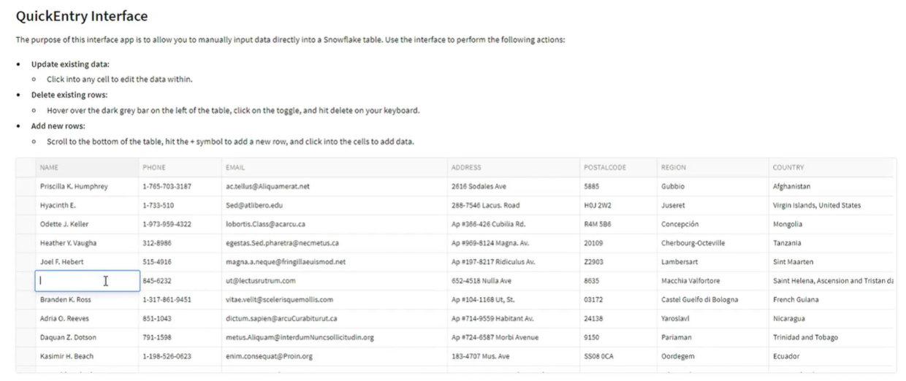
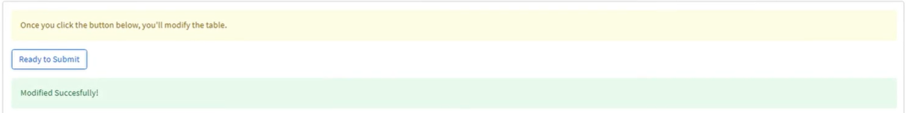

# Snowflake Data Entry App
 
## Introduction
 
The Snowflake Data Entry App is a user-friendly tool designed to streamline manual data entry tasks in Snowflake. This app simplifies the process of entering data into Snowflake tables directly.
 
## HOW TO

(1) Chose the Table



(2) Create Your Changes



(3) Click Submit



## Accessing QuickEntry Outside of AWS - ADMINS ONLY

*Note: The Following Should Only Be Read by Admins or Org Admins*

Unfortunately, while native apps are in public preview, QuickEntry can only be installed in AWS. If your account is not based on AWS, you can still benefit from QuickEntry, but you will have to use Snowflake's secure data sharing.

While the process is slightly cumbersome, we have all the code below ready for you to copy and paste. 

### Creating an account in AWS us-east-1 

This action must be performed by an orgadmin.

```sql
 create account <account_name>
   admin_name = admin
   admin_password = ''
   first_name = <first_name>
   last_name = <last_name>
   email = '<email>'
   edition = enterprise
   region = aws_us_east_1;

 # Main Account
 select system$global_account_set_parameter('<organization_name>.<account_name>', 'ENABLE_ACCOUNT_DATABASE_REPLICATION', 'true');
 # New Account Created Above
 select system$global_account_set_parameter('<organization_name>.<account_name>', 'ENABLE_ACCOUNT_DATABASE_REPLICATION', 'true');
```

### Migrate Editable Data to AWS

You will have to move the data you want people to edit over to your new account, and then share it back to your main account. Start by creating a database with everything you want to move over. 

```sql
 create database migration;
 create schema migration.editable_tables;
```

Next, you will want to clone the tables you want to make editable.

```sql
 use database migration;
 use schema editable_tables;
 create or replace table <table_clone_name> clone <original_table_name>;
```

Then you will want to share that with the new account

```sql
 alter database migration enable replication to accounts <organization_name>.<account_name>
```
Next, switch to your account in AWS and create a replica. Snowflake recommend increasing the session timeout for such operations, which you can do, but any data you're editing manually should be small enough to replicate quickly. However, please read [this documentation](https://docs.snowflake.com/en/user-guide/database-replication-config#increasing-the-statement-timeout-for-the-initial-replication) if you wish to do so.

In order to be able to write to the data, you will have to create a clone.

```sql
 create or replace database migration_replica as replica of <organization_name>.<account_name>.migration;

 alter database migration refresh;

 create or replace database migrated clone migration_replica;

 drop database migration_replica;
```

For the sake of clean-up, you may want to then drop the migration database in the original account.

```sql
 drop database migration;
```

### Sharing Data Back

Once you've done the above, you'll want to share the data back to your main account so that you can use it in any downstream processes. 

```sql
 create share <share_name>;
 grant usage on database migrated to share <share_name>;
 grant usage on schema migrated.editable_tables to share <share_name>;
 grant select on table migrated.editable_tables.<table_name> to share <share_name>;
 alter share <share_name> add accounts= <organization_name>.<account_name>;
```
